

  

<h1 align="center">WP-PFAgent™</h1>

<strong>Workflows and schemas from a sentence.</strong>

The open-source AI agent for WordPress — the conversational layer of the <a href="https://setyenv.com">Setyenv™</a> platform.

  
  
  
  
  

  <a href="https://setyenv.com"><b>Website</b></a> ·
  <a href="https://setyenv.com/docs/"><b>Documentation</b></a> ·
  <a href="https://setyenv.com/demo/"><b>Live demo</b></a> ·
  <a href="https://setyenv.com/use-case/"><b>Use case</b></a> ·
  <a href="https://setyenv.com/news"><b>News</b></a>

---

**WP-PFAgent puts an AI agent in your WordPress dashboard.** Tell it what you need in plain language — it finds, writes and edits content, moderates comments, runs WooCommerce tasks, tunes your SEO and more — always showing you what it wants to change and waiting for your click. Bring your own AI provider key: your data stays in your own database, and nothing is ever sent to us.

It is the **open-source AI layer of the [Setyenv™](https://setyenv.com) suite**. On its own it manages your WordPress site conversationally; alongside the premium platform it designs whole data schemas and visual workflows from a one-line description — every change gated behind your confirmation.

  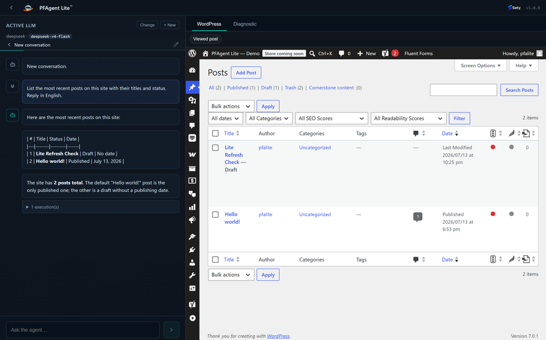

## ⚠️ Before you install — read this

WP-PFAgent is an AI agent that reads from and acts on the data in your site. You download, install and operate it **at your own responsibility**.

**Prompt-injection warning:** malicious users may plant crafted text inside your records (post titles, descriptions, comments or any stored content) to try to manipulate the agent and defeat its safeguards. You are responsible for your installation's security, for reviewing the agent's proposed actions, and for the data you expose to it.

WP-PFAgent is provided "as is", without warranty of any kind, to the maximum extent permitted by law. See the [EULA](https://setyenv.com/eula/) and the [Terms of Service](https://setyenv.com/terms-of-service/).

## See WP-PFAgent in action

| | |
|:---:|:---:|
|  | 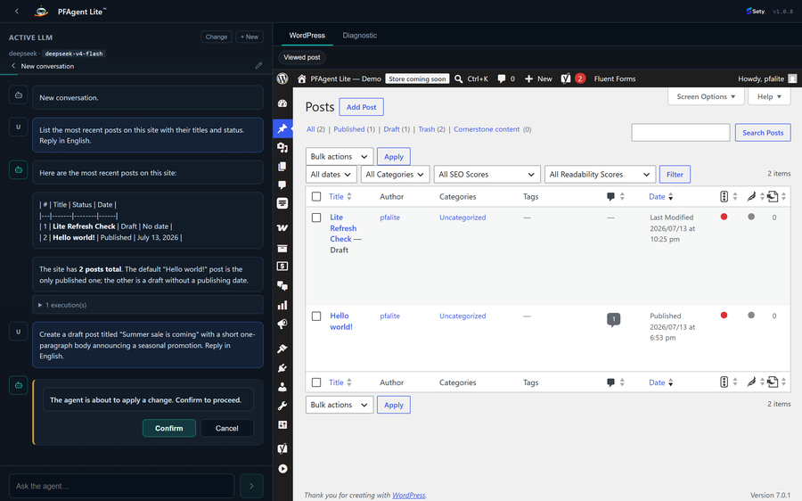 |
| **Chat in plain language.** Ask for what you need; the agent finds the right tools and drafts the work. | **You approve every change.** Any action with a side effect opens a confirmation dialog first — the agent proposes, you decide. |
| 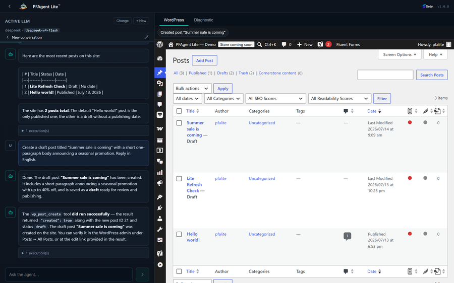 | 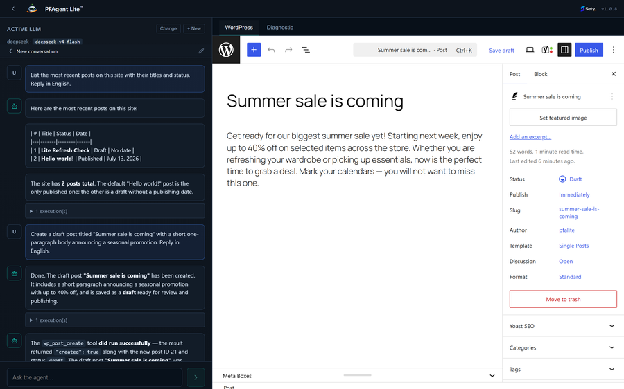 |
| **Actions land in WordPress.** Once you approve, the change is applied through WordPress's own APIs and reported back. | **The WordPress tab.** A live view of your admin that follows the agent's actions as they happen. |

  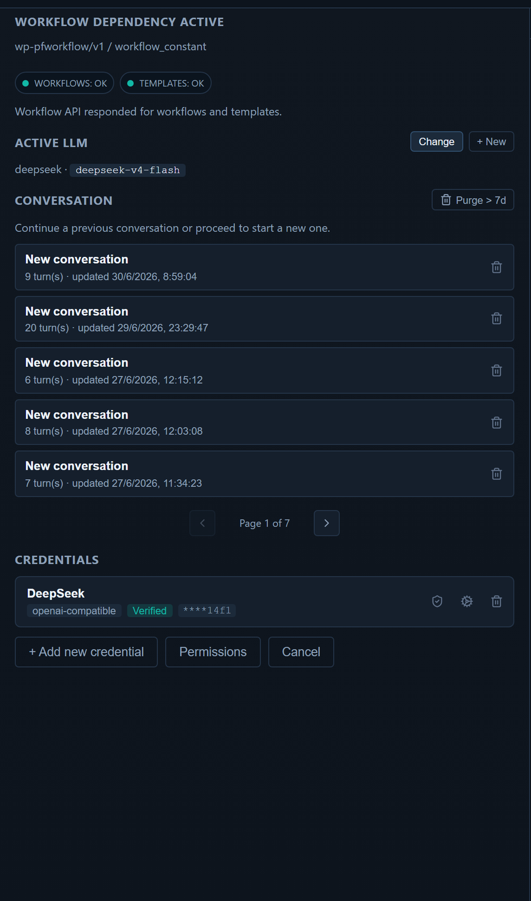
  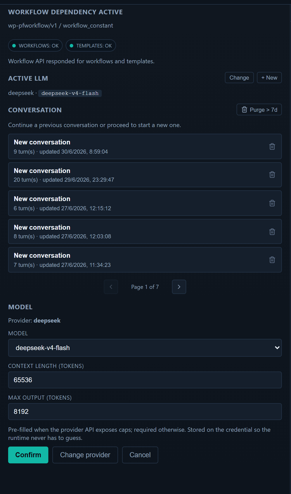

<em>Bring your own AI: configure any provider with your own key (stored encrypted), and pick the model per conversation.</em>

## What WP-PFAgent does

### You approve every change

- Every action that would modify your site opens a **confirmation dialog first**. The agent proposes; you decide. It never takes a side effect on its own.
- It respects **WordPress permissions**: every tool checks real capabilities, so the agent can never do more than the logged-in user could.
- Site options and custom fields are writable only from **strict allow-lists** — no arbitrary database writes, and other plugins' settings stay out of reach.
- It never reads, sets or reveals passwords, and role changes are guarded against privilege escalation.
- It works **exclusively through WordPress APIs** — no shell commands, no file editing, no remote code.
- Your prompts, and the content the agent reads to answer them, go **only to the AI provider you configured** — never to us.

### Manage your WordPress site

- **Posts, pages & custom post types** — list, search, read, create (drafts by default, content sanitized), edit, trash; set public custom fields (protected internal fields stay off-limits).
- **Categories, tags & taxonomies** — list, create terms, assign them to content.
- **Media** — browse the library, read item details, import an image or file from a URL (with a guard that rejects private/internal addresses).
- **Users** — list and read profiles; create users (auto-generated password, never revealed) and update profiles or roles.
- **Comments** — list and moderate: approve, hold, spam, trash, or reply.
- **Site settings** — read and adjust a safe allow-list: title, tagline, timezone, date/time format, posts per page.
- **Menus & widgets** — list navigation menus and widget areas; create a menu or add items.
- **Site overview & discovery** — WordPress version, active theme, language, content counts, installed plugins, and every content type and taxonomy other plugins register.

### Works with the plugins you already run

Each integration appears only when the matching plugin is active, talks to that plugin's own public API, and never affects the rest when absent:

- **WooCommerce** — read orders and products; with your confirmation, add order notes, change or cancel an order's status, create a pending order, add/remove line items, apply a coupon, set stock, create or edit simple products. Refunds are never automatic — the agent records a refund request for a person to review.
- **Yoast SEO, Rank Math or SEOPress** — auto-detected; read and optimize a post's SEO title, meta description and focus keyword.
- **Gravity Forms, Fluent Forms, WPForms or Contact Form 7** — list forms and browse entries; mark an entry read/unread, spam, trash, star, or add a note (within each plugin's limits).
- **LearnDash** — read courses, lessons and enrollments; enroll or unenroll a user.
- **MemberPress** — read membership products and a member's memberships; grant or revoke access (recorded as a manual transaction).

### Build with the Setyenv™ suite

With a licensed **WP-PFManagement™** and/or **WP-PFWorkflow™** on the site, WP-PFAgent becomes the conductor of the whole platform — still confirmation-gated:

- **Design data models from a sentence** — describe an entity and it creates the entity, its fields and its form layout in WP-PFManagement, ready to use.
- **Wire automations from a sentence** — describe a process and it assembles the WP-PFWorkflow graph: triggers, branches, functions and error boundaries, and can activate it.
- **Read and act across your records** — it reads and writes your WP-PFManagement data and drives WP-PFWorkflow, so "when an order is refunded, open a case and notify the owner" becomes real structure, not a prompt.

### Bring your own AI

Connect **Anthropic (Claude)**, **OpenAI**, **Google (Gemini)**, or **any OpenAI-compatible API** (DeepSeek, Groq, OpenRouter, a self-hosted endpoint…). Your key is stored encrypted in your own database, and WP-PFAgent makes **no external call until you configure a provider**. It does not phone home.

### Speaks your language

The interface ships localized in **14 languages**, and you can chat with the agent in any language your model understands.

## The Setyenv™ platform

> **Your own ServiceNow, Zapier, and ChatGPT plugins. Inside WordPress. No SaaS in the middle.**

  <picture>
    <source media="(prefers-color-scheme: dark)" srcset="assets/logo-setyenv-dark.png" />
    
  </picture>

Setyenv™ turns a WordPress install into a self-hosted automation platform — four pieces that fit together, with your process data and credentials never leaving your server. WP-PFAgent is one of them.

  

| Piece | What it is | License | Links |
|---|---|:---:|---|
| **WP-PFManagement™** | The **low-code platform**. A ServiceNow-style layer, native to WordPress: model your processes, assets and services — entities, fields, forms, lists, row- and field-level permissions and business rules — and ship real apps (ITSM, CRM, asset/CMDB, service desk) with no code. Includes first-class Agile project management: a Kanban board and a Gantt where each task's width is its duration, with typed dependencies and milestones. | proprietary | [setyenv.com](https://setyenv.com) · [repo](https://github.com/setyenv/wp-pfmanagement) |
| **WP-PFWorkflow™** | The **visual workflow engine**. Automations as diagrams you can open and read — triggers, conditional branches, function calls and error boundaries on a real execution canvas, with queue, retries, replay and idempotency. It reacts to your site's events natively (orders, record changes, schedules, webhooks). | proprietary | [setyenv.com](https://setyenv.com) · [repo](https://github.com/setyenv/wp-pfworkflow) |
| **WP-PFAgent™** *(this repo)* | The **AI agent**. Describe what you want; it manages your site and — with the suite present — designs the schema or the workflow, using your own LLM provider keys. | **open source** | [repo](https://github.com/setyenv/wp-pfagent) |
| **wp-executor** | The **host-side runner**. A single Rust binary that takes workflow events and runs them on *your own machine* — shell, files, outbound HTTP — under a capability allowlist you define. | **open source** | [repo](https://github.com/setyenv/wp-executor) |

**How they fit:** you **define** data and processes in WP-PFManagement, **automate** them in WP-PFWorkflow, reach your **own machine** through wp-executor, and drive all of it in **plain language** with WP-PFAgent. WP-PFManagement and WP-PFWorkflow are proprietary and licensed per domain (the standard build ships obfuscated and is refundable; an optional annual add-on delivers the clean PHP source). **WP-PFAgent and wp-executor are open source and free.** Try a live sandbox at [setyenv.com/demo](https://setyenv.com/demo/).

### The visual workflow engine — WP-PFWorkflow™

  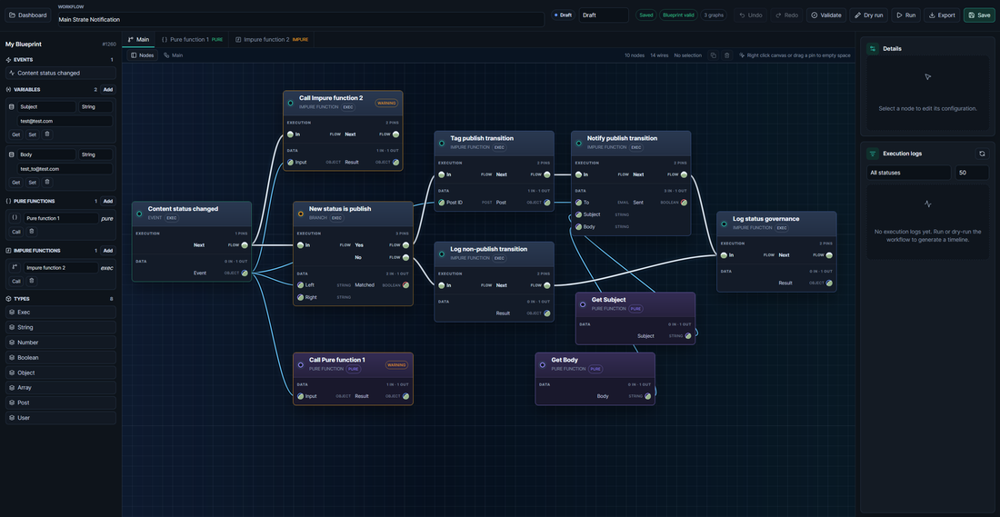

  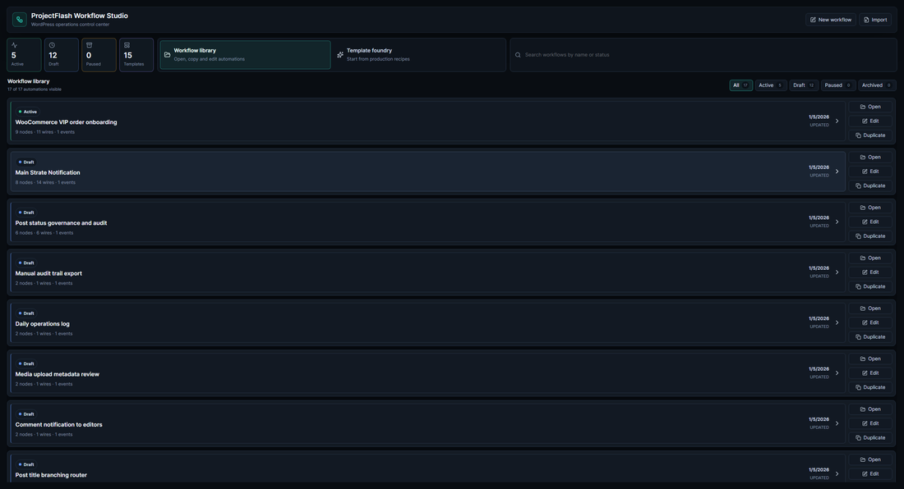

### The low-code platform — WP-PFManagement™

  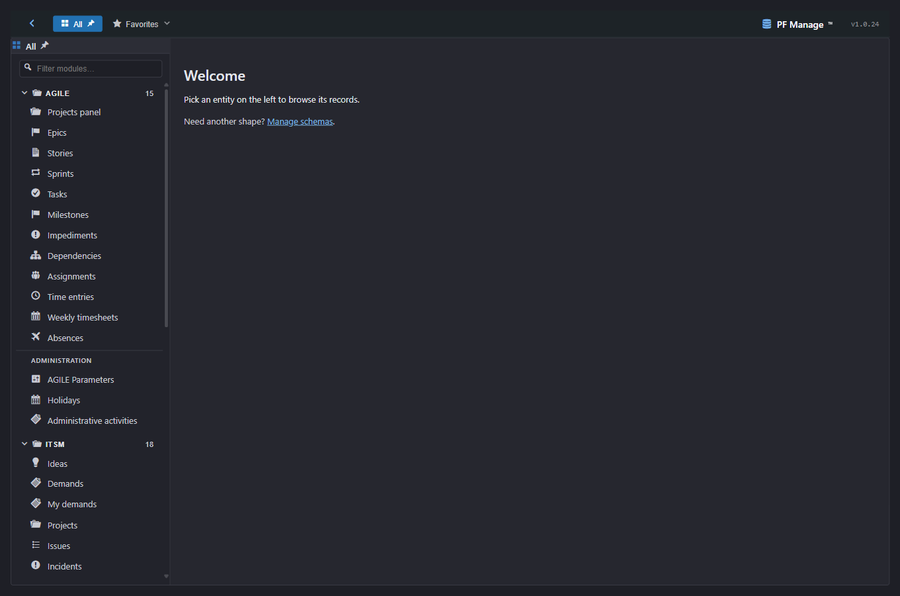
  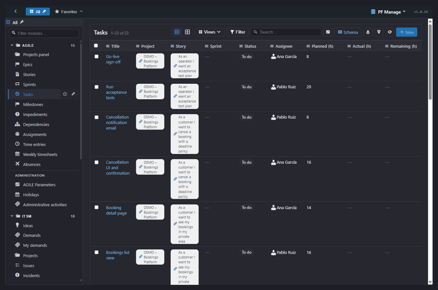

  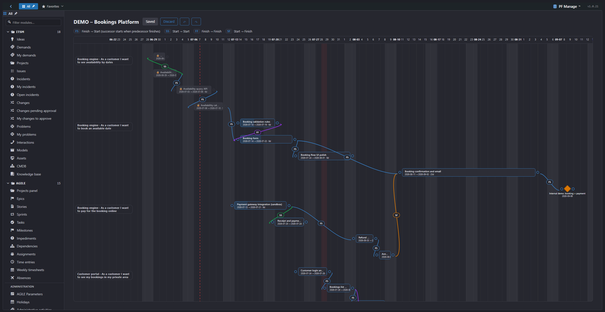

  

## A worked example, end to end

The pieces are designed to hand off to each other. Here a WooCommerce order becomes a support case, an AI triage, a workflow, and host-side work on your own machine — all inside your WordPress, no external SaaS. Full write-up at [setyenv.com/use-case](https://setyenv.com/use-case).

| | | |
|:---:|:---:|:---:|
| 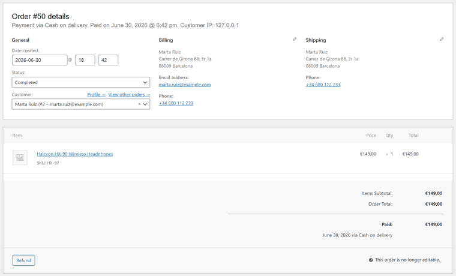 | 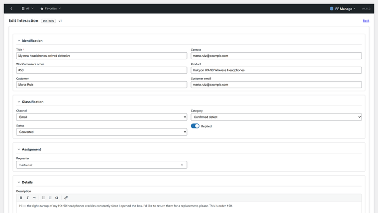 | 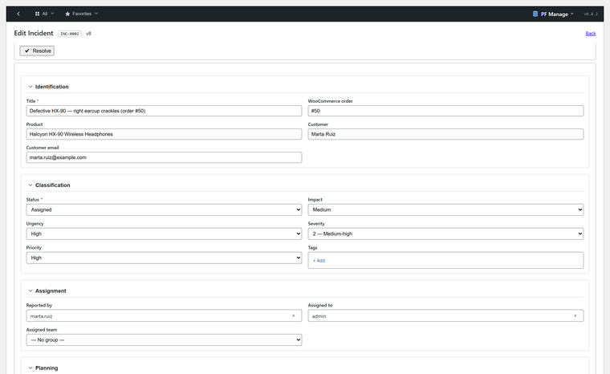 |
| **1. Order** — a WooCommerce order arrives. | **2. Support** — a case is opened in WP-PFManagement. | **3. Triage** — WP-PFAgent reads and classifies it. |

  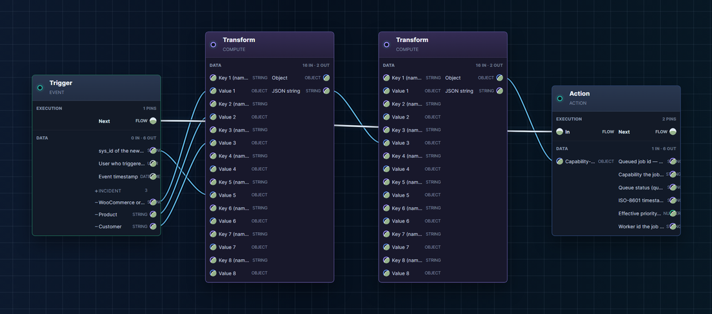

<em>4. Workflow — WP-PFWorkflow orchestrates the response: branches, functions and error boundaries on a real canvas.</em>

| | | |
|:---:|:---:|:---:|
| 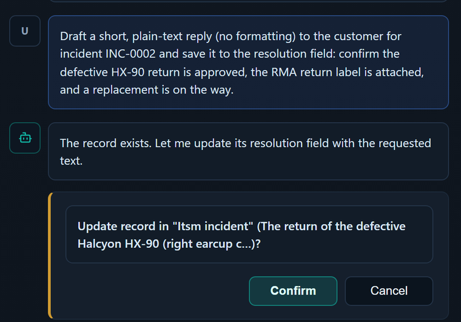 | 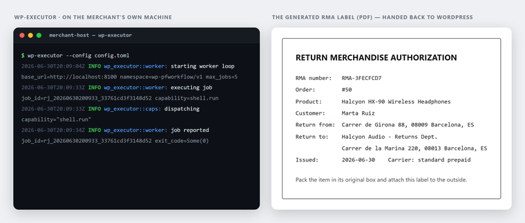 | 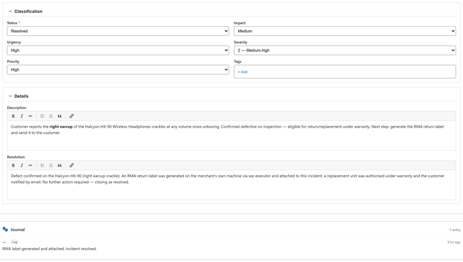 |
| **5. Agent** — WP-PFAgent drafts the reply. | **6. Executor** — wp-executor produces the RMA file on your machine. | **7. Resolution** — the case closes, fully tracked. |

## Install

1. Upload the plugin to `wp-content/plugins/`, or install the zip via **Plugins → Add New → Upload**, then activate it.
2. Open **PF Agent** in the admin menu.
3. Add your LLM provider and API key in the settings, and pick a model.
4. Start a conversation and ask the agent to do something.

**Requirements:** WordPress 6.5+, PHP 8.1+.

## Our repositories

- **[wp-pfagent](https://github.com/setyenv/wp-pfagent)** *(this repo)* — the open-source (GPL-2.0-or-later) AI agent.
- **[wp-executor](https://github.com/setyenv/wp-executor)** — the open-source (MIT OR Apache-2.0) Rust runner that executes workflow events on a machine you control.
- **[wp-pfworkflow](https://github.com/setyenv/wp-pfworkflow)** — the visual workflow engine (proprietary; landing page).
- **[wp-pfmanagement](https://github.com/setyenv/wp-pfmanagement)** — the low-code platform (proprietary; landing page).

WP-PFManagement™ and WP-PFWorkflow™ are available for evaluation, purchase and licensing at **[setyenv.com](https://setyenv.com)** — the license is per-domain and refundable, so the purchase is the trial.

## License

WP-PFAgent is free software, licensed under **GPL-2.0-or-later**. See [LICENSE](LICENSE).

Setyenv™, WP-PFWorkflow™, WP-PFManagement™ and WP-PFAgent™ are trademarks of Setyenv™.

---

## PFAgent Lite

**PFAgent Lite** is the free, transversal WordPress-core edition of this agent — the conversational site management described above (content, taxonomies, media, users, comments, settings, plus the WooCommerce, SEO, forms, LearnDash and MemberPress integrations), with no part of the premium suite required. It runs entirely on its own: no account, no locked features.

We are publishing PFAgent Lite to the **WordPress.org plugin directory** for one-click install. **Current status: _Awaiting Review_.** Until it lands there, you can install this open-source edition directly from this repository.

The premium Setyenv™ suite — WP-PFManagement™ and WP-PFWorkflow™ — is optional, and extends the same conversational approach to data modeling and automation, driven natively by the full edition of PFAgent.
